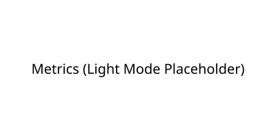

# Mohan Krishna Reyya

**Software Engineering | Backend Development | AI/ML | Autonomous AI Agents | Cloud Engineering | Full-Stack Development**

I am a final-year Computer Science student specializing in building highly scalable REST APIs, robust client-server applications, and cloud-native services using Python, Java, and Google Cloud Platform. I have a proven track record of writing clean, maintainable code throughout the Software Development Life Cycle (SDLC), and am deeply passionate about optimizing system performance and deploying reliable, production-ready software solutions.

---

## Technical Skills

- **Programming Languages:** Python, Java, JavaScript, C, C++, SQL
- **Software Engineering:** Object-Oriented Programming (OOP), Data Structures, Algorithms, Client-Server Architecture, System Design, SDLC
- **Backend Development:** RESTful APIs, FastAPI, Flask, Node.js, Web Services, Database Schema Design
- **Frontend Development:** React.js, Next.js, HTML, CSS, Bootstrap, Three.js, Responsive UI
- **Cloud & Tools:** Google Cloud Platform (GCP), Docker, Git, Linux, Firebase, Continuous Integration/Deployment (CI/CD)
- **AI & Machine Learning:** NLP, LLMs, RAG, LangChain, Scikit-learn, Pandas, NumPy
- **AI Agents & Automation:** OpenClaw, OpenRouter, Workflow Automation, API Orchestration

---

## Featured Projects

### Luna – Autonomous AI Agent System
*Autonomous cloud service for intelligent workflow automation and complex task orchestration.*
- **Technologies:** Python, OpenClaw, Google Cloud, Linux, Docker
- **Achievements:**
  - Engineered an autonomous cloud service implementing a robust client-server architecture.
  - Architected and developed scalable RESTful APIs for seamless data synchronization between large language models and external endpoints, ensuring high performance and fault tolerance.
  - Streamlined deployment pipelines by containerizing the application with Docker and hosting on a Linux-based Google Cloud (GCP) instance, achieving 24/7 system reliability.
- **Repository:** [GitHub](https://github.com/Mohan99633/Luna)

### AIDock – AI Cost Optimizer
*Full-stack platform and browser extension to analyze AI model usage and recommend highly cost-efficient computing alternatives.*
- **Technologies:** Python, FastAPI, React, OpenRouter
- **Achievements:**
  - Built a platform using software design patterns to provide cost-efficient computing alternatives.
  - Developed and integrated robust REST APIs to aggregate real-time data across multiple third-party providers, significantly optimizing inference costs and reducing query latency.
  - Designed a scalable backend infrastructure focused on seamless API integration, secure data handling, and writing clean, maintainable code utilizing standard software engineering principles.
- **Repository:** [GitHub](https://github.com/Mohan99633/AIDock)

### TripGenie AI – Intelligent Travel Planning Platform
*Comprehensive full-stack web application to generate dynamic travel itineraries.*
- **Technologies:** Next.js, FastAPI, AI Agents, Three.js
- **Achievements:**
  - Developed a highly available and responsive client-server architecture.
  - Engineered complex interactive frontend components, including a 3D globe using Three.js, demonstrating advanced UI/UX visualization skills and frontend performance optimization.
  - Built secure REST APIs to aggregate external travel data and integrate AI agents, implementing efficient data structures to ensure fast data retrieval and a seamless user experience.
- **Repository:** [GitHub](https://github.com/Mohan99633/TripGenie-AI)

---

## GitHub Statistics

<picture>
  <source media="(prefers-color-scheme: dark)" srcset="./metrics-dark.svg">
  <source media="(prefers-color-scheme: light)" srcset="./metrics-light.svg">
  
</picture>

---

## Connect with Me

- **LinkedIn:** [linkedin.com/in/mohan-krishna-reyya-823a0b235](https://www.linkedin.com/in/mohan-krishna-reyya-823a0b235)
- **Email:** [mohankrishnareyyi.888@gmail.com](mailto:mohankrishnareyyi.888@gmail.com)
